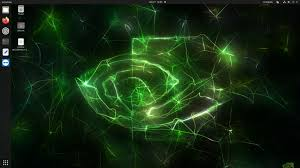
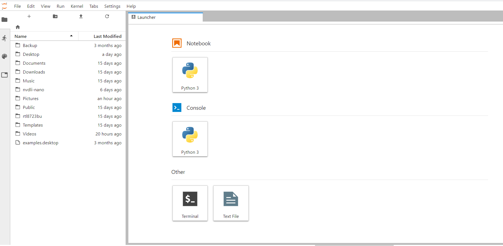

# 1 Introducción

## 1.1 Coche autónomo

Un coche autónomo es un automóvil capaz de percibir su entorno y moverse de forma segura sin intervención humana. Utiliza una combinación de tecnologías como sensores (cámaras, radares, LIDAR), inteligencia artificial, aprendizaje automático y sistemas de posicionamiento GPS para tomar decisiones de conducción en tiempo real.
Es un reto multidisciplinario que involucra ingeniería, informática, inteligencia artificial, robótica, mecánica, visión por computador, telecomunicaciones, etc. Lo que lo convierte en uno de los desafíos tecnológicos más interesantes y complejos de nuestra era.

[Coche autónomo iot](https://bit.coit.es/el-universo-iot-y-el-sistema-del-vehiculo-conectado-y-autonomo/)

[Coche autónomo wikipedia](https://es.wikipedia.org/wiki/Veh%C3%ADculo_aut%C3%B3nomo)

## 1.2 ¿Por qué utilizar JetRacer AI Kit?

[Vídeo presentación](https://www.youtube.com/watch?v=jymHOOgpDoU)

- Ideal para aprender IA aplicada. Aprender sobre frameworks reales: PyTorch, TensorFlow, OpenCV, etc.
- Hardware accesible y reproducible. Jetson Nano + cámara + chasis RC = un sistema autónomo completo por menos de 250 euros.
- Aprendizaje práctico y por experimentación. Aprendizaje práctico y por experimentación.  Montas, programas y pruebas el vehículo tú mismo.
- Entiendes el ciclo completo: percepción → decisión → control.
- Acceso remoto y entrenamiento en vivo. Puedes controlar y visualizar el auto desde tu PC mediante Wi-Fi. Entrenar modelos y desplegarlos al instante.
- Gran comunidad y soporte. Documentación oficial, notebooks y ejemplos. Puedes participar en retos comunitarios o hackatones.

# 2 ¿Qué incluye el kit?

## 2.1 Hardware

- Chasis:
    - Base para montaje del Jetson Nano.
    - Soporte para la batería, motores, y electrónica.
    - Orificios y ranuras para asegurar el sistema de dirección, sensores y la cámara.
- Fuente de alimentación: baterías 18650 (3.7V) con portabaterías (4S a 14.8V). Circuitos de protección (sobrecarga, sobredescarga, sobrecorriente y cortocircuito).
      Regulador de voltaje (DC-DC Step-Down Converter). Convierte la tensión de la batería a 5V/4A estable para el Jetson Nano.
- Sistema de tracción y dirección:
    - Motor de tracción DC sin escobillas (brushless). Con transmisión a las dos ruedas.
    - Controlador de velocidad ESC (Electronic Speed Controller). Modula la potencia enviada al motor de tracción. Controlado por PWM.
    - Servo de dirección RC: Controlado por PWM.
    - Ruedas con neumáticos de goma: Proporcionan buen agarre en pista.
- Ordenador Jetson Nano. Unidad de procesamiento principal.
    - CPU ARM Cortex-A57 de cuatro núcleos.
    - GPU NVIDIA Maxwell de 128 núcleos CUDA.
    - 4 GB de RAM LPDDR4.
	- Interfaces: 4x USB 3.0, HDMI, RJ45, CSI, GPIO (General Purpose IO), I2C, UART, etc.
- Cámara CSI (Raspberry Pi v2 compatible). Módulo de cámara CSI (Camera Serial Interface). 8 megapíxeles. Captura de imágenes o video en tiempo real.
- Módulo Wi-Fi con dos antenas. Permite conexión inalámbrica al Jetson Nano para control remoto, SSH, Jupyter Notebooks, etc.
- Pantalla OLED de 0.91" con resolución de 128×32 integrada, que muestra en tiempo real la dirección IP del vehículo, memoria, nivel de batería y otras condiciones.
- Micro SD card (32GB mínimo).
- Accesorios de control: Wireless gamepad con usb dongle de 2.4GHz.

## 2.2 Montaje

[Manual de montaje](https://www.waveshare.com/wiki/JetRacer_Assembly_Manual)

# 3 Software

## 3.1 Instalación

[Instalación software](https://www.waveshare.com/wiki/JetRacer_AI_Kit#User_Guides)

[Vídeo instalación software](https://www.youtube.com/watch?v=tmdxMAgwuAM)

## 3.2 ¿Qué se instala?

### 3.2.1 Sistema operativo

```
jetson@nano-4gb-jp451:~$ lsb_release -a
No LSB modules are available.
Distributor ID: Ubuntu
Description:    Ubuntu 18.04.5 LTS
Release:        18.04
Codename:       bionic
```

```
jetson@nano-4gb-jp451:~$ uname -a
Linux nano-4gb-jp451 4.9.201-tegra #1 SMP PREEMPT Fri Feb 19 08:40:32 PST 2021 aarch64 aarch64 aarch64 GNU/Linux
```

### 3.2.2 Jetpack

```
jetson@nano-4gb-jp451:~$ jetson_release
 - NVIDIA Jetson Nano (Developer Kit Version)
   * Jetpack 4.5.1 [L4T 32.5.1]
   * NV Power Mode: MAXN - Type: 0
   * jetson_stats.service: active
 - Libraries:
   * CUDA: 10.2.89
   * cuDNN: 8.0.0.180
   * TensorRT: 7.1.3.0
   * Visionworks: 1.6.0.501
   * OpenCV: 4.1.1 compiled CUDA: NO
   * VPI: ii libnvvpi1 1.0.15 arm64 NVIDIA Vision Programming Interface library
   * Vulkan: 1.2.70
```

### 3.2.3 PyTorch y TensorFlow

Biblioteca para desarrollar modelos de inteligencia artificial y aprendizaje profundo.

### 3.2.4 JetRacer

Biblioteca para controlar el movimiento del coche.

### 3.2.5 JetCam

Biblioteca para manejar cámaras y procesamiento de imágenes en dispositivos Jetson.

### 3.2.6 Ubuntu desktop



### 3.2.7 Jupyter



# 4 Aprendizaje Automático supervisado

[Aprendizaje supervisado](https://www.diegocalvo.es/aprendizaje-supervisado/)

## 4.1 Ejemplo regresión lineal

[Notebook regresión simple](ej_rl.ipynb)

## 4.2 Ejemplo SVM

[Notebook svm](ej_svm.ipynb)

## 4.3 Ejemplo redes neuronales convolucionales

[Redes neuronales](https://datademia.es/blog/que-es-deep-learning-y-que-es-una-red-neuronal)

[Notebook redes neuronales](ej_rn_cir-resnet18.ipynb)

# 5 Demo LIDAR

- Instalación de los drivers.
- frame_grabber.exe.

# 6 Demo coche

- Movimiento básico.
- Captura con la cámara.
- Etiquetado.
- Entrenamiento.
- Seguimiento en el circuito.

# 7 Extras

## 7.1 Aplicaciones en el mundo real

Los coches autónomos, también conocidos como vehículos autónomos o self-driving cars, ya tienen múltiples aplicaciones reales en distintos sectores del mundo. Aquí tienes un resumen de las principales aplicaciones actuales:

- Transporte público: Empresas como Waymo (Google), Cruise (GM) y Baidu están operando taxis autónomos en ciudades como San Francisco, Phoenix, y algunas ciudades chinas.
- Logística y transporte de mercancías: Empresas como Aurora, y Einride están desarrollando y probando camiones autónomos para transporte en carretera (última milla y autopistas).
- Entrega de comida y bienes: Nuro y otras startups han desplegado pequeños vehículos autónomos para entregar comestibles o medicinas.
- Operaciones industriales y agrícolas: Minas, campos agrícolas, puertos y almacenes.
- Movilidad en zonas cerradas: aeropuertos, parques temáticos, hospitales, campus universitarios.
- Competiciones de coches autónomos: Indy Autonomous Challenge, Roborace, DARPA Grand Challenge / Urban Challenge, …

[Indy Autonomous Challenge](https://www.youtube.com/@IndyAutonomousChallenge/videos)

## 7.2 Otros
- ¿Dónde se puede conseguir? Waveshare, Seeed, SparkFun.
- Alternativas: DonkeyCar (simulador).
- Cómo expandir el proyecto: detección de objetos, semáforos, etc.
